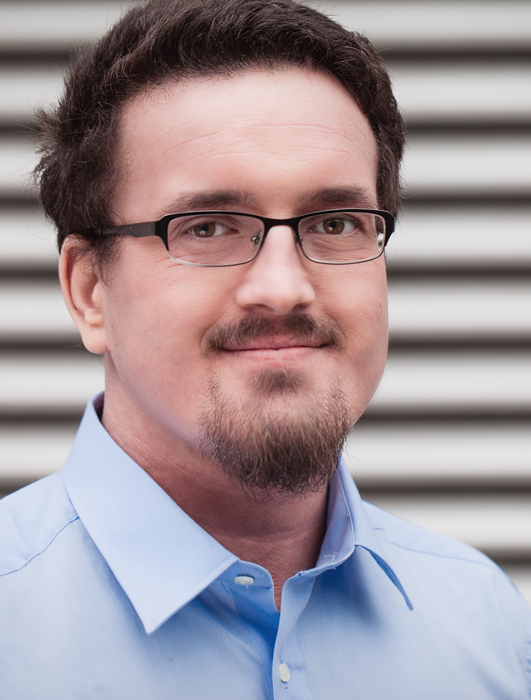
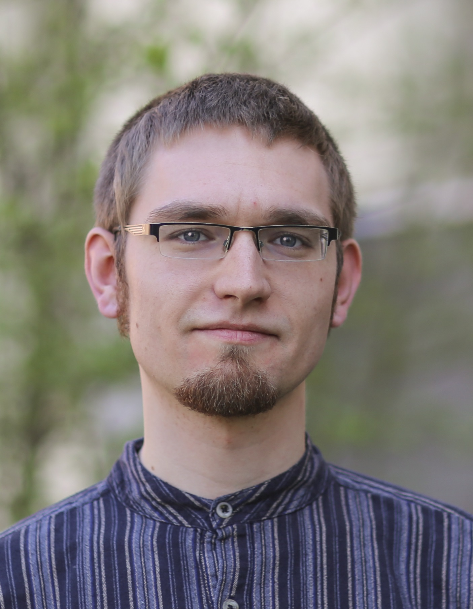

## About

Die [Java User Group](https://de.wikipedia.org/wiki/Java_User_Group) Görlitz ist eine Gruppe von
[Java](<https://de.wikipedia.org/wiki/Java_(Programmiersprache)>) Entwicklern, die seit Anfang 2011 regelmäßig Treffen
mit Vorträgen und anschließenden Diskussionen rund um das Thema "Java" organisiert und dazu alle Interessierten recht
herzlich einlädt.

Egal ob Anfänger oder Profi, ob berufstätiger Softwareentwickler oder Student/Schüler - Alle sind bei den Vorträgen und
der anschließenden Diskussion gern gesehen.

Das Themen-Spektrum reicht dabei von
[JavaEE](https://de.wikipedia.org/wiki/Java_Platform,_Enterprise_Edition)-Frameworks über mobile Anwendungen wie
[Android](<https://de.wikipedia.org/wiki/Android_(Betriebssystem)>) bis hin zu
[alternativen Programmiersprachen](https://de.wikipedia.org/wiki/Java_Virtual_Machine#JVM-Sprachen) für die Java VM.
Aber auch allgemeine Themen abseits von Java aber mit Bezug zur Softwareentwicklung wurden schon behandelt. Wir freuen
uns immer über neue Themenvorschläge und natürlich Vortragende, die zu einem Thema sprechen möchten.

Unser Ziel ist der Wissens-, Ideen- und Erfahrungsaustausch über Themen, die mit der Softwareentwicklung zu tun haben.

Die Treffen finden in der Regel monatlich jeweils am letzten Mittwoch im Monat an wechselnden Orten statt.

## Ansprechpartner

### Manuel Mauky

    

**Carl Zeiss Digital Innovation**

Software-Entwickler

[manuel.mauky@zeiss.com](mailto:manuel.mauky@zeiss.com)

[Blog: http://www.lestard.eu](http://www.lestard.eu)

Twitter: [@manuel_mauky](https://twitter.com/manuel_mauky)

---

### Max Wielsch

    

**Carl Zeiss Digital Innovation**

Software-Entwickler

[max.wielsch@zeiss.com](mailto:max.wielsch@zeiss.com)

[Blog: http://max-wielsch.blogspot.de](http://max-wielsch.blogspot.de)

Twitter: [@simawiel](https://twitter.com/simawiel)

---

### Marlene Knoche

    

**Selbstständig**

Freischaffende Künstlerin und Illustratorin

[info@sanguinik.de](mailto:info@sanguinik.de)

[Blog: http://www.sanguinik.de](http://www.sanguinik.de)

Twitter: [@SanguinikDE](https://twitter.com/SanguinikDE)

---

### Markus Ullrich

    

**Hochschule Zittau/Görlitz**

Wissenschaftlicher Mitarbeiter

[mullrich@hszg.de](mailto:mullrich@hszg.de)

[Webseite: www.ead-group.org/group/core-team/markus-ullrich.html](http://www.ead-group.org/group/core-team/markus-ullrich.html)

Twitter: [@ead_markus](https://twitter.com/ead_markus)

---

### Prof. Dr. Jörg Lässig

    

**Hochschule Zittau/Görlitz**

Fachbereich Informatik/EAD-Group

[jlaessig@hszg.de](mailto:jlaessig@hszg.de)

[Enterprise-Application-Development-Group](http://www.enterprise-application-development.org/)

---
