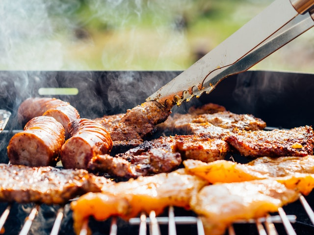
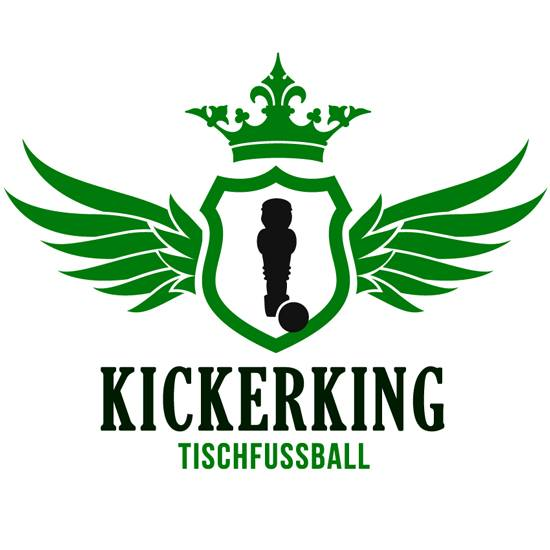

Die JUG macht Sommerpause. Im Juli gibt es deshalb keinen Vortrag.
Dafür veranstalten wir dieses Jahr zum ersten mal ein **JUG-Grill-Abend** am Freitag, den 21. Juli.

Dazu treffen wir uns in den Räumlichkeiten des [Görlitzer Kickerking e.V.](http://www.gr-kickerking.de/)
auf der [Hospital-Straße 14](https://goo.gl/maps/jx11ctvt5EN2), wie immer ab 19 Uhr.

Bitte bringt Grillgut mit, welches ihr auf den Grill werfen wollt.
Getränke können beim Kickerking-Verein erworben werden.
Da der Verein seine Räumlichkeiten unter anderem auch durch Getränkeverkauf finanziert, und wir zu Gast sind,
bitten wir euch, von selbst mitgebrachten Getränken abzusehen.

Während und nach dem Grillen kann natürlich gerne gekickert werden.
Da Freitags auch das Vereinstraining stattfindet, ist das die Gelegenheit,
sich ein paar Tricks und Techniken zeigen zu lassen.

Außerdem steht ein [Retro-Pie](https://retropie.org.uk/), eine XBox mit StreetFighter und ein [Original C64](https://de.wikipedia.org/wiki/Commodore_64) zum Spielen am Beamer bereit.

Es dürfte also ein spannender Abend werden.

Um den Abend besser planen zu können, bitten wir euch, euch in die folgende Doodle-Liste einzutragen,
wenn ihr Teilnehmen möchtet. Kurzentschloßene können aber natürlich auch spontan dazustoßen.

[Doodle für Teilnahme](https://doodle.com/poll/cd8zwgdragxbhf5h)

---

Datum: 21.07.2017, 19:00 Uhr

Ort: Görlitzer Kickerking e.V., Hospital-Straße 14, 02826 Görlitz
