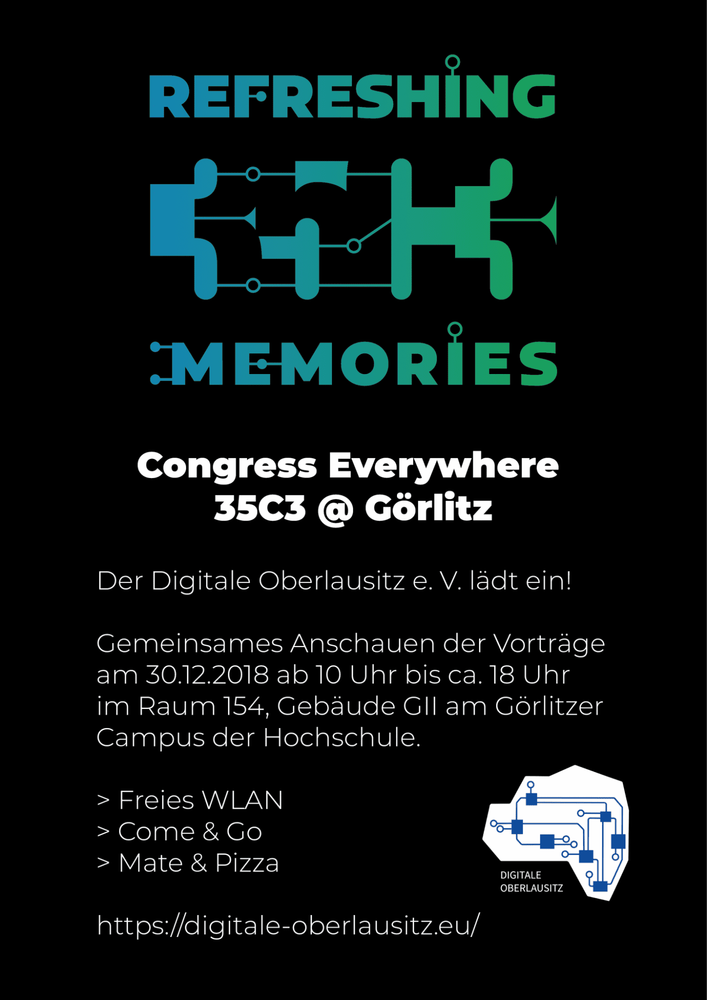

 

Jedes Jahr, kurz vor dem Jahreswechsel veranstaltet der Chaos-Computer-Club seinen
[Chaos Communication Congress (35C3)](https://events.ccc.de/category/congress/35c3/) mit [Vorträgen](https://fahrplan.events.ccc.de/congress/2018/Fahrplan/) zu
technischen, kulturellen und politischen Themen und Aktionen.
Für alle, die nicht vor Ort in Leipzig dabei sein können, werden die Vorträge live gestreamt und zum [späteren Anschauen](https://media.ccc.de/c/34c3) aufgezeichnet.
a
Wir laden deshalb herzlich dazu ein, am 30.12.2018 in den Räumlichkeiten der Hochschule mit uns zusammen Vorträge anzuschauen,
zu diskutieren und an eigenen Projekten zu basteln.
Dazu steht uns der Raum 154 im [Gebäude G2](https://goo.gl/maps/T6ZCKMjt1zR2) im Zeitraum zwischen 10 und ca. 18 Uhr zur Verfügung.

---

Datum: 30.12.2018, zwischen 10:00 und 18:00 Uhr  
Ort: Hochschule Zittau/Görlitz, Fachbereich Informatik
Raum 154 im Gebäude G2
Brückenstraße 1    
02826 Görlitz
