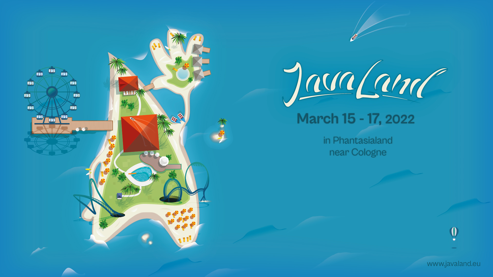

 

<h1>JavaLand 2022</h1>
Auch in diesem Jahr lädt die JavaLand-Konferenz zu Vorträgen, Workshops, Community-Activitäten und Networking ein.
Die JavaLand wird vom iJug, dem Verband der deutschsprachigen JavaUserGroups organisiert.
Sie findet vom 15. bis 17. März 2022 im Phantasialand Brühl statt.

