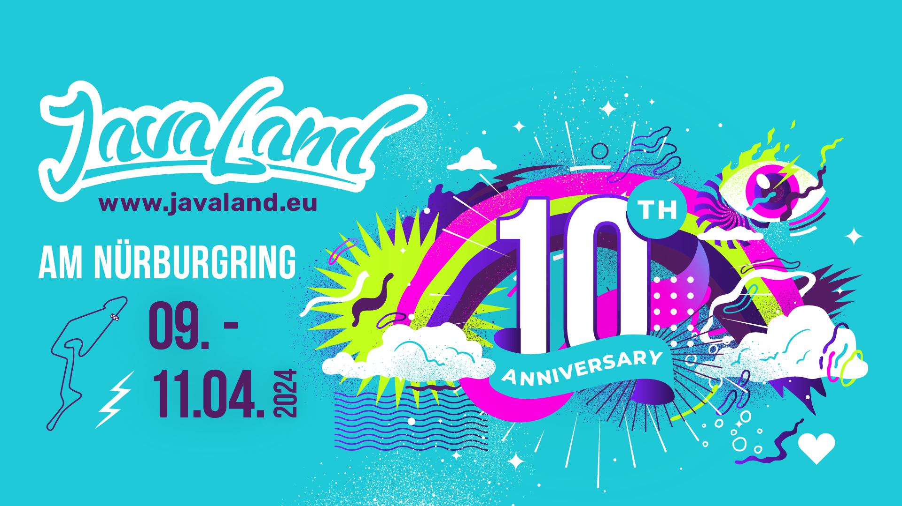

# JavaLand 2024

Die JavaLand-Konferenz feiert ihren zehnten Geburtstag! 
Die Jubiläumsausgabe findet dieses mal vom **9. bis 11. April** am **Nürburgring** statt. 

Die JavaLand wird vom iJUG e.V., dem Verband der deutschsprachigen JavaUserGroups organisiert und ist eine 
Community-Konferenz, bei der neben den Vorträgen auch diverse Community-Aktivitäten im Vordergrund stehen.

Bis zum 15. Februar gibt es einen exklusiven Frühbucher-Preis. 
Auf für die Übernachtung und den Transport zum Nürburgring stehen diverse Optionen bereit.
Weitere Infos findet ihr [auf der Javaland-Website](https://www.javaland.eu/de/home/news/details/javaland-2024-gestaltet-euer-individuelles-konferenz-erlebnis-mit-der-community/)

