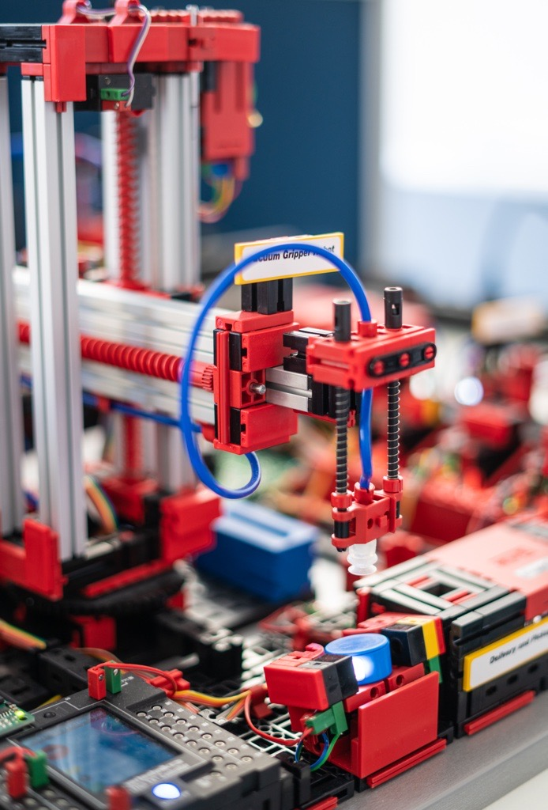

Mit der *fischertechnik* Lernfabrik haben wir eine Fabrik im Kleinformat! Steuerung, Edge und Cloud in Einem!

In diesem Vortrag lernen wir die Technologien und Möglichkeiten von Industrie 4.0 praktisch kennen. Wir nutzen das Industrieprotokoll *OPC-UA* zur Maschinenkommunikation und Edge-Services um Fabrikdaten in die Cloud zu laden. Wir sehen uns die Services hinter einem Dashboard an und mit der Siemens *S7* Steuerung tunen wir unsere Fabrik.

---

Hinweis: Bitte meldet euch zur **Teilnahme über jug-gr(at)digitale-oberlausitz.eu** an. Wir haben eine begrenzte Anzahl von 25 Plätzen zur Verfügung, die nicht überschritten werden darf.
